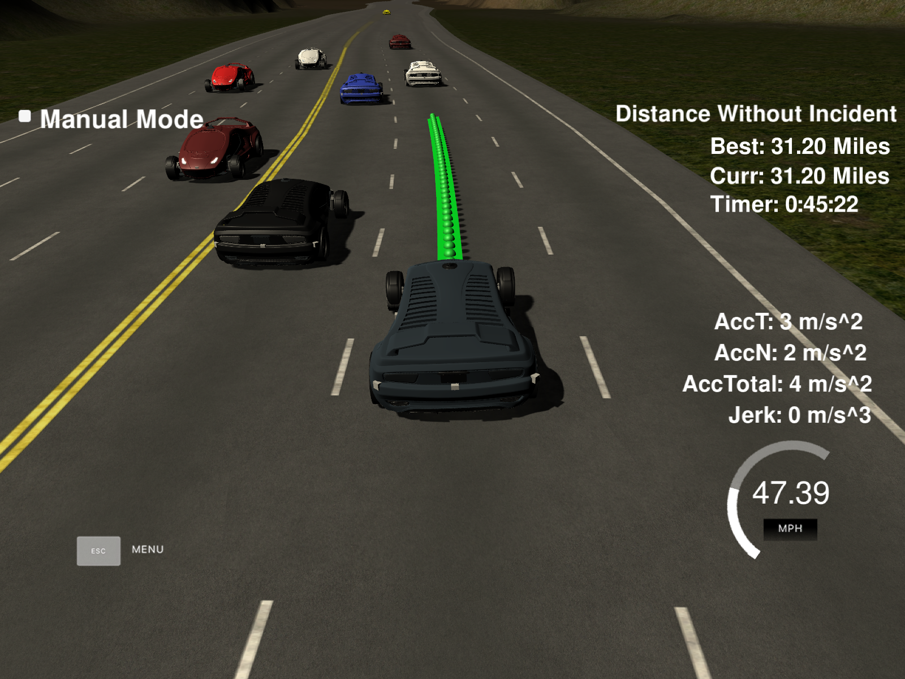

# Path Planning Project for Highway Driving
Self-Driving Car Engineer Nanodegree Programme
   
## Goals
In this project the goal is to safely navigate round a virtual highway with other traffic that is driving within &pm;10 mph of the 50 mph speed limit. The ego vehicle's localisation and sensor fusion data are provided, and there is also a sparse map list of waypoints around the highway.

The car should try to drive as close as possible to the 50 mph speed limit at all times, which means overtaking slower traffic when possible, bearing in mind that other cars will try changing lanes too. The car should avoid hitting other vehicles at all costs whilst driving inside of the marked road lanes at all times, except when switching lanes. The car should be able to make one complete loop round the 6946 m highway. Since the car is trying to go at 50 mph (80 kph), it should take a little over 5 minutes to complete one loop. Also the car should not experience total acceleration over 10 m/s<sup>2</sup> and jerk that is greater than 10 m/s<sup>3</sup>.

## Path Planner performance

Below is a sample video of the car driving round the highway loop for more than 10 minutes, during which it safely executes several lane change manoeuvres, and also opts to stay in lane and maintain a safety distance buffer with respect to the car in front when switching lanes is not possible.

[](https://www.youtube.com/watch?v=s8iEPtWN17g)

This algorithm is capable of driving the car without incident for a much longer duration, as can be seen in the screenshot below. During this run the car has travelled over 30 miles, and for longer than 45 minutes.



## Details of the Path Planner Algorithm

The path planner is initialised in [main.cpp](https://github.com/shahid-n/path-planning-project/blob/master/src/main.cpp) based on the map of the highway. Using the data from the simulator, the path planner creates its own instances of the ego vehicle and the surrounding cars with appropriate attributes (position, velocity, etc.) which would allow the planner to issue commands to the ego vehicle and help it negotiate the highway safely by means of lane changes (for overtaking slower cars) and braking to avoid collisions with other cars when there is no viable path around them.

### Summary of logic and high level control

The default behaviour of the ego vehicle is to stay in its lane and negotiate the loop at the maximum allowed speed (49.5 miles per hour). In case the prediction logic detects that the ego vehicle will get too close to a vehicle which is directly ahead in the same lane, it has the following options (see [PathPlanner::path()](https://github.com/shahid-n/path-planning-project/blob/master/src/pathPlanner.cpp#L102)):

- _Slow down_: if there is no faster lane or if it is not safe to switch lanes
- _Change lane_: if a faster lane is detected and it is safe to change the lane

#### Safety distance calculation

The safe distance to a car directly ahead of the ego vehicle is calculated in [PathPlanner::safetyDistance](https://github.com/shahid-n/path-planning-project/blob/master/src/pathPlanner.cpp#L85) as a function of the ego vehicle's speed.

#### Prediction logic

The prediction of the location of the ego vehicle is defined by the end point of the previous path that was calculated in the previous iteration.

The prediction of the location of other target vehicles which are ahead of the ego vehicle within a 100 m range is performed according to the following iterative formula (see [line 123 in PathPlanner::path()](https://github.com/shahid-n/path-planning-project/blob/master/src/pathPlanner.cpp#L123)):
```
check_obj_s += ((double) prev_size*TICK_S*check_speed);
```

#### Identification of the fastest lane

For each lane the minimum lane speed is calculated based on the cars that are visible in the range of the front sensor or up to 10 metres behind the ego vehicle. This helps to avoid collisions with cars which are within close proximity of the ego vehicle. Details of this logic can be reviewed in [PathPlanner::laneSpeed](https://github.com/shahid-n/path-planning-project/blob/master/src/pathPlanner.cpp#L35).

Next, in order to select the fastest lane, we iterate over all the lanes and select the fastest (or most open) amongst them. If several lanes allow for the same fastest speed, the lane which is closest to the ego vehicle is chosen. This helps to avoid unnecessary lane changes. The technical details of the implementation can be found in [PathPlanner::fastestLane()](https://github.com/shahid-n/path-planning-project/blob/master/src/pathPlanner.cpp#L66).

#### Safety measures

The behaviour planner ensures that the ego vehicle stays in its lane if a lane change is deemed unsafe. A lane change is considered safe if there is no other vehicle in the target lane within the safety distance in front of the ego vehicle and the safety distance of any vehicle in the target lane. For details, see [PathPlanner::safetyCosts](https://github.com/shahid-n/path-planning-project/blob/master/src/pathPlanner.cpp#L50).

#### Trajectory generation

A smooth trajectory is calculated by fitting a cubic spline through some previous path points of the ego vehicle and some future points from the map. The actual future path points to be followed by the ego vehicle are extrapolated from this spline. This helps to avoid excessive jerk and acceleration beyond the prescribed limits, and ensures that the lane changes occur smoothly.

## Conclusions

### Preliminary remarks

The path planner algorithm submitted for this project appears to work well on the track used by the simulator, and at a nominal cruising speed of roughly 49.5 mph in the absence of obstacles in the ego vehicle's path. However, the implemented logic is somewhat simplistic and does not account for overt misbehaviour of other cars. Specifically, in the current implementation, the algorithm cannot react adroitly and take suitable countermeasures in response to aggressive manoeuvres performed by any cars in close proximity to the ego vehicle.

### Future improvements

The submitted code has been tuned to try and maximise the amount of time and laps round the highway loop without any incidents such as collisions or excessive braking or acceleration events. Since the timer and mileage counters are both reset if emergency braking causes the ego vehicle to violate the acceleration and jerk limits, the code has been adjusted to obey a uniform acceleration limit of +0.5 mph / (0.02 s) execution step and a deceleration of -1.25 mph / (0.02 s) at all times -- details can be found starting on [line 159 of PathPlanner::path()](https://github.com/shahid-n/path-planning-project/blob/master/src/pathPlanner.cpp#L159).

By way of future enhancements, I would split the algorithm into separate Behaviour Planner and Trajectory Generator modules. Specifically, the implementation of a formal state machine for behaviour planning and the evaluation of different predicted behaviours and candidate trajectories based on optimising cost functions would result in noticeable improvements.

Last but not least, a dedicated cost function with associated logic to deal with emergency situations would help mitigate the likelihood of collisions almost down to zero, with the caveat that there will be certain situations in which hard braking which violates the constraints of the project rubric would sometimes be unavoidable, causing the timer and mileage counter to reset. Furthermore, it should be possible to transition into this state even whilst a lane change manoeuvre is in progress, since there is currently a limitation in the lane switching logic which precludes braking until after the lane change is complete.

## Basic Build Instructions

1. Clone this repo.
2. Make a build directory: `mkdir build && cd build`
3. Compile: `cmake .. && make`
4. Run it: `./path_planning`.

## Structure and Data Flow

Here is the data provided from the Simulator to the C++ programme.

### The map of the highway is in data/highway_map.txt
Each waypoint in the list contains [_x_, _y_, _s_, _dx_, _dy_] values. _x_ and _y_ are the waypoint's map coordinate position, the _s_ value is the distance along the road to get to that waypoint in metres, the _dx_ and _dy_ values define the unit normal vector pointing out of the highway loop.

The highway's waypoints loop around so the frenet _s_ value, distance along the road, goes from 0 to 6945.554 m.

### Ego vehicle localisation data (no noise)

["x"] The car's _x_ position in map coordinates

["y"] The car's _y_ position in map coordinates

["s"] The car's _s_ position in frenet coordinates

["d"] The car's _d_ position in frenet coordinates

["yaw"] The car's yaw angle in the map

["speed"] The car's speed in mph

### Previous path data given to the Planner

["previous_path_x"] The previous list of x points previously given to the simulator

["previous_path_y"] The previous list of y points previously given to the simulator

### Previous path's end _s_ and _d_ values 

["end_path_s"] The previous list's last point's frenet _s_ value

["end_path_d"] The previous list's last point's frenet _d_ value

### Sensor Fusion Data, a list of all other car's attributes on the same side of the road (no noise)

["sensor_fusion"] A 2-D vector of cars and then each car's attributes: car's unique ID, car's _x_ and _y_ positions in map _x_ and _y_ velocity components in m/s, _s_ and _d_ positions in frenet coordinates, respectively. 

## Details

1. The car uses a perfect controller and will visit every (_x_, _y_) point it recieves in the list every 0.02 seconds. The units for the (_x_, _y_) points are in metres and the relative spacing of the points determines the speed of the car. The vector going from a point to the next point in the list dictates the angle of the car. Acceleration both in the tangential and normal directions is measured along with the jerk. The (_x_, _y_) point paths that the planner recieves should not have a total acceleration that goes over 10 m/s<sup>2</sup>, and moreover, the jerk should not exceed 10 m/s<sup>3</sup>.

2. There will be some latency between the simulator running and the path planner returning a path; however, with optimised code it is not very significant, perhaps just 1-3 time steps. During this delay the simulator will continue using points that it was last given. Consequently, a buffer is used to store several recently visited points to allow for a smooth transition. The variables `previous_path_x`, and `previous_path_y` can be helpful for this transition since they show the last points given to the simulator controller with the processed points already removed.

## Helper code reference

A really helpful resource for doing this project and creating smooth trajectories was using http://kluge.in-chemnitz.de/opensource/spline/, the spline function is in a single hearder file is really easy to use.

---

## Dependencies

* cmake >= 3.5
  * All OSes: [click here for installation instructions](https://cmake.org/install/)
* make >= 4.1
  * Linux: make is installed by default on most Linux distros
  * Mac: [install Xcode command line tools to get make](https://developer.apple.com/xcode/features/)
  * Windows: [Click here for installation instructions](http://gnuwin32.sourceforge.net/packages/make.htm)
* gcc/g++ >= 5.4
  * Linux: gcc / g++ is installed by default on most Linux distros
  * Mac: same deal as make - [install Xcode command line tools]((https://developer.apple.com/xcode/features/)
  * Windows: recommend using [MinGW](http://www.mingw.org/)
* [uWebSockets](https://github.com/uWebSockets/uWebSockets)
  * Run either `install-mac.sh` or `install-ubuntu.sh`.
  * If you install from source, checkout to commit `e94b6e1`, i.e.
    ```
    git clone https://github.com/uWebSockets/uWebSockets 
    cd uWebSockets
    git checkout e94b6e1
    ```
